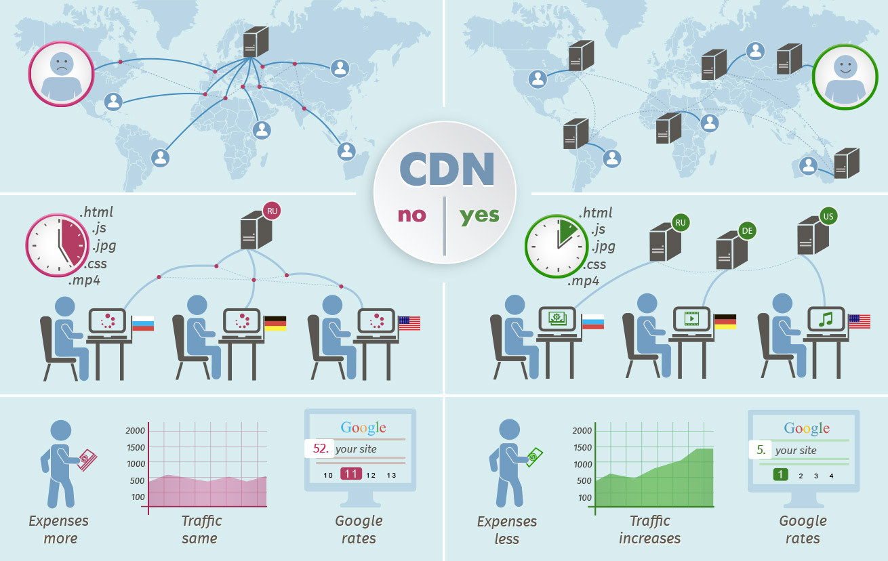

<!--
 * @Author: East Wind
 * @Date: 2021-08-21 15:55:58
 * @LastEditTime: 2021-08-21 17:41:17
 * @LastEditors: Please set LastEditors
 * @Description: vue3 + ts 学习 第二遍 —— 此次要求吃透
 * @FilePath: \vue3-round2\vue3+ts.md
-->

# Vue3 + TS round2

## 01 邂逅体验 Vue3 和 Vue3 源码

### 认识 Vue

1. Vue —— 渐进式框架
2. 前端学习：
   1. JavaScript(TypeScript)
   2. Flutter
   3. Android / iOS
3. 前端框架：
   1. 国内
      1. Vue
      2. React
      3. Angular
   2. 国外
      1. React
      2. Vue
      3. Angular
4. 后端：
   1. Java
   2. Go
   3. Node

### Vue3 新特性

1. 更好的性能
2. 更小的包体积
3. 更好的 TypeScript 集成
4. 更优秀的 API 设计

### Vue3 的源码变化

1. monorepo 的形式管理源码
   1. monorepo：将多个项目代码存储在一个仓库里的软件开发策略
   2. 优势：
      1. 多个包本身相互独立，同时又在一个仓库下方便管理
      2. 模块划分得更加清晰，可维护性、可扩展性更强
2. TypeScript 重写代码
3. Proxy 进行数据劫持：Vue2 中使用 Object.defuneProperty
4. 删除一些不必要的 API：
   1. 实例上的 $on, $off, $once
   2. 一些特性：filter, <ins>内联模板(?)</ins>等
5. 编译方面的优化：生成 Block Tree、Slot 编译优化、diff 算法优化
6. Composition API：<-- Options API
7. Hooks 函数增加代码的复用性

### Vue3 引入

1. CDN 引入
   1. `<script src="https://unpkg.com/vue@next"></script>`
   2. CDN：
      1. 内容分发网络(Content Delivery/Distribution Network)
      2. Origin Server --> CDN Server --> User 
2. 下载引入
3. 通过 npm 包管理工具安装使用(webpack 时再讲)
4. Vue CLI 创建项目，并使用

### 计数器案例

- 原生 JavaScript

  ```html
  <div>
    <h2 id="counter">0</h2>
    <button id="incBtn">+1</button>
    <button id="decBtn">-1</button>
  </div>

  <script>
    // 获取元素
    const counterEl = document.querySelector("#counter");
    const incBtnEl = document.querySelector("#incBtn");
    const decBtnEl = document.querySelector("#decBtn");

    // 声明 h2 中数字的变量
    let count = 0;
    counterEl.innerHTML = count;

    // 点击按钮事件
    incBtnEl.addEventListener("click", () => {
      console.log("点击了 +1 按钮");
      count++;
      counterEl.innerHTML = count;
    });
    decBtnEl.addEventListener("click", () => {
      console.log("点击了 -1 按钮");
      count--;
      counterEl.innerHTML = count;
    });
  </script>
  ```

- Vue2

  ```html
  <div id="app"></div>

  <script src="https://unpkg.com/vue@next"></script>
  <script>
    const app = Vue.createApp({
      template: `
          <div>
            <h2>{{counter}}</h2>
            <button @click='increment'>+1</button>
            <button @click='decrement'>-1</button>
          </div>
        `,
      data() {
        return {
          counter: 0,
        };
      },
      methods: {
        increment() {
          this.counter++;
        },
        decrement() {
          this.counter--;
        },
      },
    });
    app.mount("#app");
  </script>
  ```

- Vue3

  ```html
  <div id="app"></div>

  <script src="https://unpkg.com/vue@next"></script>
  <script>
    Vue.createApp({
      template: `
          <div>
            <h2>{{count}}</h2>
            <button @click='increment'>+1</button>
            <button @click='decrement'>-1</button>
          </div>
        `,
      setup() {
        let count = Vue.ref(0);
        const increment = () => {
          count.value++;
        };
        const decrement = () => {
          count.value--;
        };

        return {
          count,
          increment,
          decrement,
        };
      },
    }).mount("#app");
  </script>
  ```

### 声明式 与 命令式

1. 声明式
   1. 程序员：what to do
   2. 框架(机器)：how
2. 命令式
   1. 程序员：how to do

### MVVM 模型


### template 属性

1. template —— 原生 HTML 标签
2. 抽取 template 方式

   1. x-template js

      ```html
      <div id="app"></div>

      <script src="https://unpkg.com/vue@next"></script>
      <script id="hello" type="x-template">
        <div>{{ msg }}</div>
      </script>
      <script>
        Vue.createApp({
          template: "#hello",
          data() {
            return {
              msg: "hello template",
            };
          },
        }).mount("#app");
      </script>
      ```

   2. template 标签

      ```html
      <div id="app"></div>

      <template id="hello">
        <div>{{ msg }}</div>
      </template>

      <script src="https://unpkg.com/vue@next"></script>
      <script>
        Vue.createApp({
          template: "#hello",
          data() {
            return {
              msg: "hello template",
            };
          },
        }).mount("#app");
      </script>
      ```

### Vue3 源码

1. `git clone https://github.com/vuejs/vue-next.git`
2. `yarn install`
3. `yarn dev`
4. 进入 VUE-NEXT/packages/vue/examples 下创建 demo/demo.html

   ```html
   <div id="app"></div>

   <script src="../../dist/vue.global.js"></script>
   <script>
     debugger; <!-- 调试的代码 -->
     const app = Vue.createApp({
       template: `<h2>hello Vue3!</h2>`,
     });
     app.mount("#app");
   </script>
   ```

5. VUE-NEXT/package.json 修改 "dev" 脚本为 `"node scripts/dev.js --sourcemap"`
6. 打开页面进行调试
7. 太难了看不懂呜呜呜

### 课后问题

1. 为什么 methods 中不能使用箭头函数？
2. 不使用箭头函数的情况下，this 到底指向的是什么？
