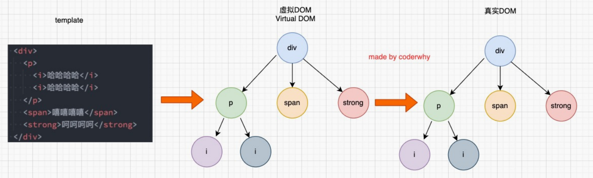
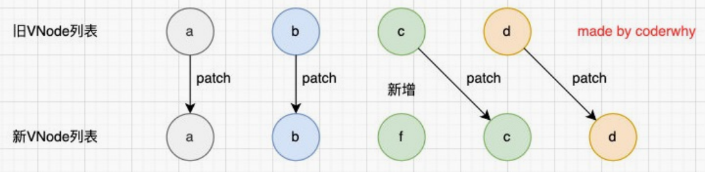

<!--
 * @Author: East Wind
 * @Date: 2021-08-21 15:55:58
 * @LastEditTime: 2021-08-27 00:24:41
 * @LastEditors: Please set LastEditors
 * @Description: vue3 + ts 学习 第二遍 —— 此次要求吃透
 * @FilePath: \vue3-round2\vue3+ts.md
-->

# Vue3 + TS round2

## 01 邂逅体验 Vue3 和 Vue3 源码

### 认识 Vue

1. Vue —— 渐进式框架
2. 前端学习：
   1. JavaScript(TypeScript)
   2. Flutter
   3. Android / iOS
3. 前端框架：
   1. 国内
      1. Vue
      2. React
      3. Angular
   2. 国外
      1. React
      2. Vue
      3. Angular
4. 后端：
   1. Java
   2. Go
   3. Node

### Vue3 新特性

1. 更好的性能
2. 更小的包体积
3. 更好的 TypeScript 集成
4. 更优秀的 API 设计

### Vue3 的源码变化

1. monorepo 的形式管理源码
   1. monorepo：将多个项目代码存储在一个仓库里的软件开发策略
   2. 优势：
      1. 多个包本身相互独立，同时又在一个仓库下方便管理
      2. 模块划分得更加清晰，可维护性、可扩展性更强
2. TypeScript 重写代码
3. Proxy 进行数据劫持：Vue2 中使用 Object.defuneProperty
4. 删除一些不必要的 API：
   1. 实例上的 $on, $off, $once
   2. 一些特性：filter, <ins>内联模板(?)</ins>等
5. 编译方面的优化：生成 Block Tree、Slot 编译优化、diff 算法优化
6. Composition API：<-- Options API
7. Hooks 函数增加代码的复用性

### Vue3 引入

1. CDN 引入
   1. `<script src="https://unpkg.com/vue@next"></script>`
   2. CDN：
      1. 内容分发网络(Content Delivery/Distribution Network)
      2. Origin Server --> CDN Server --> User 
2. 下载引入
3. 通过 npm 包管理工具安装使用(webpack 时再讲)
4. Vue CLI 创建项目，并使用

### 计数器案例

- 原生 JavaScript

  ```html
  <div>
    <h2 id="counter">0</h2>
    <button id="incBtn">+1</button>
    <button id="decBtn">-1</button>
  </div>

  <script>
    // 获取元素
    const counterEl = document.querySelector("#counter");
    const incBtnEl = document.querySelector("#incBtn");
    const decBtnEl = document.querySelector("#decBtn");

    // 声明 h2 中数字的变量
    let count = 0;
    counterEl.innerHTML = count;

    // 点击按钮事件
    incBtnEl.addEventListener("click", () => {
      console.log("点击了 +1 按钮");
      count++;
      counterEl.innerHTML = count;
    });
    decBtnEl.addEventListener("click", () => {
      console.log("点击了 -1 按钮");
      count--;
      counterEl.innerHTML = count;
    });
  </script>
  ```

- Vue2

  ```html
  <div id="app"></div>

  <script src="https://unpkg.com/vue@next"></script>
  <script>
    const app = Vue.createApp({
      template: `
          <div>
            <h2>{{counter}}</h2>
            <button @click='increment'>+1</button>
            <button @click='decrement'>-1</button>
          </div>
        `,
      data() {
        return {
          counter: 0,
        };
      },
      methods: {
        increment() {
          this.counter++;
        },
        decrement() {
          this.counter--;
        },
      },
    });
    app.mount("#app");
  </script>
  ```

- Vue3

  ```html
  <div id="app"></div>

  <script src="https://unpkg.com/vue@next"></script>
  <script>
    Vue.createApp({
      template: `
          <div>
            <h2>{{count}}</h2>
            <button @click='increment'>+1</button>
            <button @click='decrement'>-1</button>
          </div>
        `,
      setup() {
        let count = Vue.ref(0);
        const increment = () => {
          count.value++;
        };
        const decrement = () => {
          count.value--;
        };

        return {
          count,
          increment,
          decrement,
        };
      },
    }).mount("#app");
  </script>
  ```

### 声明式 与 命令式

1. 声明式
   1. 程序员：what to do
   2. 框架(机器)：how
2. 命令式
   1. 程序员：how to do

### MVVM 模型


### template 属性

1. template —— 原生 HTML 标签
2. 抽取 template 方式

   1. x-template js

      ```html
      <div id="app"></div>

      <script src="https://unpkg.com/vue@next"></script>
      <script id="hello" type="x-template">
        <div>{{ msg }}</div>
      </script>
      <script>
        Vue.createApp({
          template: "#hello",
          data() {
            return {
              msg: "hello template",
            };
          },
        }).mount("#app");
      </script>
      ```

   2. template 标签

      ```html
      <div id="app"></div>

      <template id="hello">
        <div>{{ msg }}</div>
      </template>

      <script src="https://unpkg.com/vue@next"></script>
      <script>
        Vue.createApp({
          template: "#hello",
          data() {
            return {
              msg: "hello template",
            };
          },
        }).mount("#app");
      </script>
      ```

### Vue3 源码

1. `git clone https://github.com/vuejs/vue-next.git`
2. `yarn install`
3. `yarn dev`
4. 进入 VUE-NEXT/packages/vue/examples 下创建 demo/demo.html

   ```html
   <div id="app"></div>

   <script src="../../dist/vue.global.js"></script>
   <script>
     debugger; <!-- 调试的代码 -->
     const app = Vue.createApp({
       template: `<h2>hello Vue3!</h2>`,
     });
     app.mount("#app");
   </script>
   ```

5. VUE-NEXT/package.json 修改 "dev" 脚本为 `"node scripts/dev.js --sourcemap"`
6. 打开页面进行调试
7. 太难了看不懂呜呜呜

### 课后问题

1. 为什么 methods 中不能使用箭头函数？
   1. 箭头函数的 this 是上层作用域中的 this，即 window
   2. 当 this 是 window 时，methods 中无法获取 data 返回对象中的数据
   3. this 绑定规则：[https://mp.weixin.qq.com/s/hYm0JgBI25grNG_2sCRlTA](https://mp.weixin.qq.com/s/hYm0JgBI25grNG_2sCRlTA)
2. 不使用箭头函数的情况下，this 到底指向的是什么？
   1. 指向 实例的 proxy

## 02 Vue3 模板语法常见的指令

### VSCode 代码片段编写

1. Preference -> User Snippets -> html.json
2. 要快捷命令编写的 文本
3. snippet generator 网站生成 json 格式
4. 粘贴进 html.json 文件

### Vue 模板语法

- 基于 HTML
- 声明式绑定 DOM 和底层组件实例的数据

1. Mustache 语法
2. v-once
3. v-text
4. v-html
5. v-pre：不解析 mustache 语法
6. v-cloak
7. v-bind 绑定属性
   1. 属性名不固定：`<div :[key]="{value}"></div>`
   2. 自定义属性：`<div v-bind="{info}"></div>` info 是对象
8. v-on 交互
   1. 一次性绑定多个事件：`<div v-on="{click: handleClick, mousemove: handleMousemove}"></div>`
   2. 参数传递：`<div @click="handleClick($event, param)"></div>`
   3. 修饰符
      1. .stop
      2. ... 感觉没必要了，基本用不到

## 03 Vue 基础-模板语法（二）

### 条件渲染

1. v-if v-else v-else-if
   1. 惰性
      1. 只有在条件为 true 时，才会渲染标签
      2. 当条件为 false 时，其判断的内容完全**不会被渲染**或**会被销毁掉**
   2. 配合 template 使用
      1. 不可见的包裹元素
      2. 最终不存在。（若使用 div，则性能会被浪费）
2. v-show
   1. 其 DOM 会被渲染，但 `display: none;`
   2. 不支持 template

### 列表渲染

- v-for
  - 数组形式：`v-for="(item, index) in arr"`
  - 对象形式：`v-for="(value, key, index) in obj"`
  - 数字形式：`v-for="(num, index) in 10"`
  - 使用 template 对多个元素进行包裹

### v-for 中的 key

#### 认识 VNode

1. Virtual Node，虚拟节点
2. VNode 的本质是一个 JavaScript 对象
3. VNode Tree
   1. 组件 or 元素 --> VNode
   2. 一大堆的元素 --> 多个 VNode --> VNode Tree --> 真实 DOM

#### diff 算法

- 有 key
  - 执行 patchKeyedChildren 方法
    - 从头部开始遍历，遇到相同节点继续，不同则跳出循环
    - 从尾部开始遍历，相同继续，不同跳出循环
    - 如果最后新节点更多，则添加新节点
    - 如果旧节点更多，则移除旧节点
    - 如果中间存在不知道如何排序的位置序列，则使用 key 建立索引图，最大限度地使用旧节点
- 没有 key
  - 执行 patchUnkeyedChildren 方法

## 04 Vue3 的 Options API

### 复杂 data 的处理方式

- 插值语法
  - 简单的运算
  - 否则模板过重，难以维护
- methods
  - 所有 data 使用过程都会变成一个方法的调用
- computed
  - 所有 getter 和 setter 的 this 上下文自动绑定为组件实例

### computed 的用法

- `computed: { [key: string]: Function | { get: Function, set: Function } }`
  - Function:
    ```javascript
    computed: {
      myMsg() {
        return '我的' + this.msg
      }
    }
    ```
  - { get: Function, set: Function }
    ```javascript
    computed: {
      myMsg: {
        get() {
          return '我的' + this.msg
        },
        set(value) {
          console.log(value)
        }
      }
    }
    ```

### computed 源码

- computed 中的某一项 是否为函数
  - Y：对该函数绑定 publicThis，并传入 publicThis
  - N：该项的 get 是否为函数
    - Y：对该项的 get 函数绑定 publicThis，并传入 publicThis
    - N：设置该项的 get 为 () => {}
      

### 认识侦听器

- 类型：`watch: { [key: string]: string | Function | Object | Array }`
  - 离谱的写法不管了...
  - `[key: string]: Function`
    ```javascript
    watch: {
      info(newInfo, oldInfo) {
        console.log('新的', newInfo, '旧的', oldInfo)
      }
    }
    ```
  - `[key: string]: Object`
    ```javascript
    watch: {
       info: {
         handler(newInfo, oldInfo) {
           console.log('新的', newInfo, '旧的', oldInfo)
         },
         deep: true, // 深度侦听
         immediate: true // 立即执行
       }
     }
    ```
- created 中写法
  ```javascript
  created() {
    this.$watch(
      'info',
      (newInfo, oldInfo) => {
        console.log('新的', newInfo, '旧的', oldInfo)
      },
      {
        deep: true,
        immediate: true
      }
    )
  }
  ```

### 购物车案例

- index.html

  ```html
  <!DOCTYPE html>
  <html lang="en">
    <head>
      <meta charset="UTF-8" />
      <meta http-equiv="X-UA-Compatible" content="IE=edge" />
      <meta name="viewport" content="width=device-width, initial-scale=1.0" />
      <title>Document</title>
      <link rel="stylesheet" href="./index.css" />
    </head>
    <body>
      <div id="app"></div>

      <template id="my-app">
        <template v-if="books.length >= 1">
          <table>
            <thead>
              <th></th>
              <th>书籍名称</th>
              <th>出版日期</th>
              <th>价格</th>
              <th>购买数量</th>
              <th>操作</th>
            </thead>
            <tbody>
              <template v-for="(item, index) in filterBooks">
                <tr>
                  <td>{{ index + 1 }}</td>
                  <td>{{ item.name }}</td>
                  <td>{{ item.date }}</td>
                  <td>{{ item.price }}</td>
                  <td>
                    <button
                      :disabled="item.count <= 1"
                      @click="handleDecrement(index)"
                    >
                      -
                    </button>
                    {{ item.count }}
                    <button @click="handleIncrement(index)">+</button>
                  </td>
                  <td><button @click="handleDelete(index)">移除</button></td>
                </tr>
              </template>
            </tbody>
          </table>
          <h2>总价：{{ getTotalPrice() }}</h2>
        </template>
        <template v-else>
          <div>
            <h2>购物车空了</h2>
          </div>
        </template>
      </template>

      <script src="https://unpkg.com/vue@next"></script>
      <script src="./index.js"></script>
    </body>
  </html>
  ```

- index.js

  ```javascript
  const why = {
    template: "#my-app",
    data() {
      return {
        books: [
          {
            id: 1,
            name: "算法导论",
            date: "2006-09",
            price: 85,
            count: 1,
          },
          {
            id: 2,
            name: "UNIX编程艺术",
            date: "2006-02",
            price: 59,
            count: 1,
          },
          {
            id: 3,
            name: "编程珠玑",
            date: "2008-10",
            price: 39,
            count: 1,
          },
          {
            id: 4,
            name: "代码大全",
            date: "2006-03",
            price: 128,
            count: 1,
          },
        ],
        totalPrice: 0,
      };
    },
    methods: {
      handleIncrement(index) {
        this.books[index].count++;
      },
      handleDecrement(index) {
        this.books[index].count--;
      },
      handleDelete(index) {
        this.books.splice(index, 1);
      },
      getTotalPrice() {
        let sum = 0;
        for (const item of this.books) {
          sum += item.price * item.count;
        }
        return "￥" + sum;
      },
    },
    computed: {
      filterBooks() {
        return this.books.map((item) => {
          const newItem = Object.assign({}, item); // Object.assign 只拷贝一层
          newItem.price = "￥" + newItem.price;
          return newItem;
        });
      },
    },
  };

  const app = Vue.createApp(why);
  app.mount("#app");
  ```

- index.css

  ```css
  table {
    width: 500px;
    text-align: center;
    border-collapse: collapse;
  }

  table,
  th,
  td {
    border: 1px solid #ccc;
  }

  thead {
    background-color: #eee;
  }

  th,
  td {
    padding: 5px;
  }
  ```

## 05 v-model 和注册 Vue 组件

### 前情提要

1. vue3 API：watch 的不同写法
2. 侦听数组、对象的某一项的引用，新旧值会相同，因为是引用地址
3. 一般对于深层次的侦听，选择在子组件中侦听

### 对象的引用 —— 浅拷贝 —— 深拷贝

1. 对象的引用
2. 对象的浅拷贝
3. 对象的深拷贝 —— 等 js 高级课程
   ```javascript
   const info = {
     name: "east",
     age: 22,
     friends: [
       {
         name: "wind",
         age: 22,
       },
     ],
   };
   // JSON 方法
   const info_copy01 = JSON.parse(JSON.stringify(info));
   // lodash 方法
   // 引入lodash
   const info_copy02 = _.cloneDeep(info);
   ```

### v-model

- v-model = (v-bind 绑定 value) + (v-on 绑定 input 事件)
- 绑定表单元素
- 修饰符
  - .lazy
  - .number
  - .trim: 去除首尾空格

### 组件化开发

- 组件化：整个页面 --> 拆分 --> 独立可复用的组件 --> 组件树 --> 整个页面
- 注册组件
  - 全局注册：`app.component(组件名，组件对象)`
  - 局部注册：`App = { ..., components: { 组件名: 组件对象 } }`

### Vue 的开发模式

> SFC --> webpack/rollup/vite 打包

- SFC 使用方式
  - Vue CLI ---- 目前 webpack
  - webpack/rollup/vite

## 06 webpack 基础打包和 css 打包

### 认识 webpack

1. 前端开发发展
   1. 模块化
   2. ES6+、TS、sass、less 等高级特性
   3. 热更新：实时地监听文件的变化，并且反映到浏览器上
   4. 将代码进行压缩、合并以及其他相关的优化
2. Webpack is a static module bundler for modern JavaScript applications.

### webapck 的使用

- 依赖于 node 环境
- 安装：npm install webpack webpack-cli -g (webpack-cli 用于命令行敲代码，脚手架中不用)
- 局部 webpack (实际项目使用)
  - `npm init`：创建 package.json 文件，用于管理项目的信息、库依赖等
  - `npm install webpack webpack-cli -D`
  - 在 root/src 下创建 index.js 文件，是 webpack 的入口文件
  - `npx webpack`
  - 在 package.json 中添加脚本：`"build": "webpack"`
  - `npm run build`

### Webpack 的配置文件

- 若修改 webpack.config.js 的文件名，则修改 "build" 脚本为 `webpack --(配置文件名)`
- 配置文件基本模板
- 添加样式编译的 loader
  - 需要用到的 loader：css-loader, style-loader, less-loader(less 中使用)
    - `npm install css-loader style-loader less-loader -D`
  - 配置文件
- PostCSS
  - 一个通过 JavaScript 来转换样式的工具
  - 进行一些 CSS 的转换和适配，比如自动添加浏览器前缀、CSS 样式的重置
  - 用到再说....不习惯
