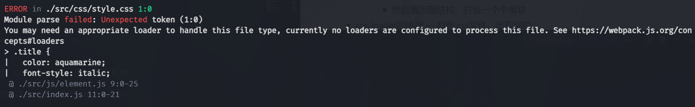

<!--
 * @Author: your name
 * @Date: 2021-05-10 20:09:09
 * @LastEditTime: 2021-06-11 22:02:30
 * @LastEditors: Please set LastEditors
 * @Description: coderwhy的Vue+TypeScript
 * @FilePath: \Learning-Summary\2021\Vue\vue3.md
-->
# Vue3

## 2021.05.10
### Vue项目通常需要掌握哪些技术栈？
1. Vue3全家桶
   1. Vue3核心语法
   2.Vue-Router路由
   3. Vuex状态管理
2. Vue3组件库
   1. AntDesign UI
   2. 
3. 可视化库
4. TypeScript
5. 其他技术栈

### 如何学习Vue3 + TypeScript
1. 官方文档
   1. 如何抓住重点
   2. 如何进行实战练习
   3. 更多作为查阅的手册
2. 看书学习 —— 你所不知道的JavaScript
   1. 书的质量必须很高
   2. 必须动手进行练习
   3. 遇到问题如何解决？
3. 开源项目
   1. 非常好的学习手段
   2. 需要具备一定的学习能力，需要一定的基础
4. 视频课程
   1. 比较适合大多数人
   2. 讲课人本身的能力
   3. 视频质量要高、听得懂、学得会

### 系统学习Vue3和TypeScript
1. 课程定位：基础 → 实战 → 原理（源码）
2. 课程核心内容
   1. Vue3核心知识深入解析
   2. Vue-Router4.x、Vuex4.x、Composition API等详细解析
   3. 基于Webpack5、Vite2分别搭建Vue3项目
   4. TypeScript基础、高级语法解析、应用、实战
   5. Vue3、Vue-Router、Vuex、Hooks、Element-Plus、Echarts、TypeScript、Axios、Less的后台管理系统项目实战
   6. 项目实战中的高级组件拆分、封装，项目架构设计等
   7. Vue3项目的打包、优化、自动化部署等
   8. Vue3相关的原理、源码解读等

## 2021.05.12 邂逅话题
### 邂逅话题
+ Vue —— 一套用于构建用户界面的**渐进式**框架
+ 前端流行三大框架
  - Angular
    * 入门门槛较高
    * 国内市场占有率较低
    * 使用TypeScript开发
  - React
    * 国内外市场占有率非常高
    * 必学框架
  - Vue
    * 国内市场占有率最高

### Vue3的变化
1. 命名为“One Piece”
2. 新特性
   1. 更好的性能
   2. 更小的包体积
   3. 更好的TypeScript集成
   4. 更优秀的API设计
3. （源码）带来的变化
   1. 通过monorepo的形式来管理源代码
      1. Mono：单个
      2. Repo：repository仓库
      3. 主要是将项目的代码存储在同一个repository中
      4. 目的：多个包本身相互独立，可以有自己的功能逻辑、功能测试等，同时又在同一个仓库下方便管理
      5. 优势：模块划分更清晰，可维护性、可扩展性更强
   2. 源代码使用TypeScript来进行重写
      1. 在Vue2.x中，使用Flow进行类型检测
      2. 在Vue3.x中，全部源码使用TypeScript重构，其本身对TypeScript的支持也更好了
4. （性能）带来的变化
   1. 使用Proxy进行数据劫持
      1. Vue2.x中，使用Object.definePorperty来劫持数据的getter和setter方法
      2. 该方法无法劫持和监听对象添加或删除属性的情况
      3. Vue2.x中提供特殊的API，如$set、$delete这类hack方法
      4. Proxy可以做到
   2. 删除一些不必要的API
      1. 移除了实例上的$on, $off, $once
      2. 移除了一些特性：filter, 内联模板
   3. 编译方面的优化
      1. 生成Block Tree, Slot编译优化, diff算法优化
5. （API）带来的变化
   1. 由Options API到Composition API
      1. 
      2. 
      3. 
      4.
   2. Hooks函数增加代码的复用性
      1. 
      2. 
      3. 
      4.

### Vue引入方式
1. CDN(Content Delivery Network / Content Distribution Network)
   1. 定义：内容分发网络，通过互相连接的网络系统，利用最靠近每个用户的服务器，更快、更可靠地将音乐、图片、视频、应用程序及其他文件发送给用户
   2. 目的：提供高性能、可扩展性及低成本地网络内容传递给用户
   3. CDN服务器，边缘节点
   4. CDN服务器分类
      1. 自己的CDN服务器
      2. 开源CDN服务器
   `<script src="https://unpkg.com/vue@next"></script>`
2. 下载和引入
   1. 下载Vue源代码
      1. 在浏览器打开网址https://unpkg.com/vue@next，得到打包后的Vue源码
      2. 复制粘贴 → 下载
   2. 引入：src引入即可

### 代码解析
#### CDN引入，最基础代码
1. 创建Vue实例
   ```javascript
   const app = Vue.createApp(对象)
   app.mount(div) // 挂载到哪一个div上
   ```
2. 挂载的div
   ```html
   <body>
      <div id="app"></div>
   </body>
   ```
3. 对象
   ```javascript
   const 对象 = {
      template: '<h1>模板代码</h1>'
   }
   ```
4. 链式调用写法
   ```javascript
   Vue.createApp(对象)
     .mount(div)
   ```
#### 计数器案例 —— 原生与Vue框架的对比
1. 原生
   ```html
   <h2 class="counter">0</h2>
   <button class="increment">+1</button>
   <button class="decrement">-1</button>
   ```
   ```javascript
   // 1. 获取所有的标签
   const counterEl = document.querySelector('counter')
   const incrementEl = document.querySelector('increment')
   const decrementEl = document.querySelector('decrement')

   // 2. 定义变量，用于存储counter的值
   let counter = 100
   counterEl.innerHTML = counter

   // 3. 监听按钮的点击
   increment.addEventListener('click', function() {
      counter++
      counterEl.innerHTML = counter
   })
   decrement.addEventListener('click', function() {
      counter--
      counterEl.innerHTML = counter
   })
   ```
2. Vue
   ```html
   <div id="app"></div>
   ```
   ```javascript
   Vue.createApp({
     template: `
       <div>
         <h2 class="counter">{{counter}}</h2>
         <button @click="increment">+1</button>
         <button @click="decrement">-1</button>
       </div>
     `,
     // data内的数据会被加入Vue的响应式系统中
     data () {
       counter: 100
     },
     // methods中方法与元素绑定
     methods: {
       increment () {
         this.counter++
       }
       decrement () {
         this.counter--
       }
     }
   }).mount('#app')
   ```
3. 分析：声明式 VS 命令式
   1. 声明式
      1. 关注what to do，由框架完成how的过程
      2. 声明模板、数据、方法等，框架进行绑定操作：实例中，模板与数据等绑定 → 实例与页面中div绑定
      3. Vue使用MVVM模式（并没有完全遵守）
         1. View：HTML
         2. Model：JavaScript
         3. ViewModel：Vue
   2. 命令式
      1. 关注how to do，一步一步告诉编译器怎么做
      2. 取到页面中的div → 变量与div绑定 → 给变量添加事件

### template属性
1. 作用：替换挂载的元素
2. 存在Vue特有的语法
3. 不同使用方式
   ```javascript
   Vue.createApp({
     template: '#app',
     // data内的数据会被加入Vue的响应式系统中
     data () {
       counter: 100
     },
     // methods中方法与元素绑定
     methods: {
       increment () {
         this.counter++
       }
       decrement () {
         this.counter--
       }
     }
   }).mount('#app')
   ```
   1. script形式
      ```javascript
      <script type="x-template" id="app">
        <div>
          <h2>{{counter}}</h2>
          <button @click="increment">+1</button>
          <button @click="decrement">-1</button>
        </div>
      </script>
      ```
   2. template形式
      ```html
      <!-- template是HTML原生标签，浏览器知道有这块代码存在，但不会渲染 -->
      <template id="app">
        <div>
          <h2>{{counter}}</h2>
          <button @click="increment">+1</button>
          <button @click="decrement">-1</button>
        </div>
      </template>
      ```

### data属性
1. 使用
   1. 在Vue2.x中，可以传入一个对象（官方推荐函数）
   2. 在Vue3.x中，只能传入函数，否则报错
2. data中返回的对象会被Vue的响应式系统劫持，之后对该对象的访问或者修改都会在劫持中被处理
   1. 因此，在template中通过{{counter}}可以访问counter，可以从对象中获取到数据
   2. 所以，修改counter的值，template中的{{counter}}也会发生改变

### methods属性
1. methods是一个对象，在该对象中定义许多方法
   1. 这些方法会被绑定到template模板中
   2. 在方法中，可以使用this关键字来直接访问data中返回对象的属性
2. 关于this
   1. 不应该使用箭头函数来定义method函数

### 其他属性
再说。

### Vue3源码调试
1. `npm install yarn -g`：vue3源码使用yarn管理
2. `yarn install`：安装依赖
3. `yarn dev`：打包代码至packages\vue\dist中
4. `"dev": "node scripts/dev.js --sourcemap"`：查看源码
   
### 题外话
1. vscode插件
   1. Remote - SSH
   2. Remote - SSH:Editing Configuration
   3. Terminal Tabs
   4. TSLint
   5. Vetur
   6. VSCode Great Icons
   7. vscode-icons
   8. vscode-styled-components
   9. Vue VScode Snippets
   10. Vue 3 Snippets
   11. Atom One Dark Theme
   12. Auto Close Tag
   13. Bookmarks
   14. Bracket Pair Colorizer
   15. browserslist
   16. Dart
   17. DotEnv
   18. Draw.io Integration
   19. EJS language support
   20. ES7 React/Redux/GraphQL
   21. ESLint

## 2021-05-17 Vue3基础语法一：模板语法
### methods方法绑定this
[详情](https://mp.weixin.qq.com/s/hYm0JgBI25grNG_2sCRlTA)

### 模板语法
1. vue也支持jsx的开发模式
2. 但大多数情况下，使用基于HTML的模板语法
3. 在模板中，允许开发者以声明式的方式将DOM和底层组件实例的数据绑定在一起
4. 在底层的实现中，Vue将模板编译成虚拟DOM渲染函数

具体语法
+ Mustache语法：双大括号方式，表达式，调用函数，计算属性
+ 指令
  - v-once：数据自增区别
  - v-text：要展示的内容`<h2 v-text="message"></h2>`
  - v-html：将普通文本转化为html语言
  - v-pre：
  - v-cloak：
  - v-bind
    * 绑定对象语法：`<div :class="{className: boolean
    }">哈哈哈哈</div>
    * 绑定数组语法：`<div :class="[className]"></div>`
    * 绑定三元运算符：建议不用
    * 绑定数组内可以使用对象
    * style绑定：`<div :style="{color: 'red'}"></div>
    * 绑定属性名称：`<div :[attr]="value"></div>`
    * 绑定对象：`<div v-bind="object"></div>`
  - v-on：交互
    * 绑定对象：多个事件`<div v-on="{click: btnClick, mousemove: move}">
    * 带参数：`<div @click="handleClick($event, value)"></div>`
    * .stop：阻止冒泡


## 2021-05-19 Vue基础-模板语法(二)
### 条件渲染
+ v-if
  - v-if是惰性的，不会被渲染，或者会被销毁
  - v-if常与template结合使用，减少不必要的div元素
+ v-else
+ v-else-if
+ v-show
  - v-show不支持template一起使用
  - v-show不可以和v-else一起使用
  - `v-show="false"` === `display: none`

### 列表渲染 v-for
+ 基本格式：`item in 数组`
+ 支持的类型
  - 数组
  - 对象
  - 数字

### 数组更新检测
+ Vue将被侦听的数组更新方法进行了包裹，所以它们也会触发视图更新(修改原数组)
  - push()
  - pop()
  - shift()
  - unshift()
  - splice()
  - sort()
  - reverse()
+ 另外的修改数组方法(生成新的数组)
  - filter()
  - contact()
  - slice()

### **key的作用**
+ 在使用v-for进行列表渲染时，推荐绑定key属性
+ 官方解释
  - 主要用在Vue的虚拟DOM算法，在新旧nodes对比辨识VNodes
  - 如不使用key，Vue会使用一种最大限度减少动态元素并且尽可能地尝试就地<u>修改/复用相同类型</u>的算法
  - 如使用key，Vue会基于key的变化重新排列元素顺序，并且会<u>移除/销毁key</u>不存在的元素
+ 认识VNode
  - 全称：Virtual Node，即虚拟节点
  - 无论是组件还是元素，在Vue中表示出来都是一个个VNode：template → VNode → 真实DOM
  - VNode实际上是一个JavaScript对象
+ 虚拟DOM(Virtual DOM)
  - 如果不只是一个简单的div，而是有一大堆的元素，那么它应该会形成一个VNode Tree


## 2021-05-20 基础语法(三)
### 复杂data的处理方式
+ 在模板中，可以直接通过插值语法显示data中的数据
+ 对数据进行处理后再显示
  - 插值表达式
    * 复杂逻辑
    * 重复代码
  - methods的options中
    * 重复调用
  - 计算属性computed
    * 对于任何包含响应式数据的复杂逻辑，都应该使用计算属性
    * 具有缓存

### 计算属性的setter和getter

### 认识侦听器watch
+ 作用：在代码逻辑中监听某个数据的变化
+ 侦听情况
  - 默认情况下，只能侦听到数据本身的变化(内部变化无法侦听到)
  - 深度侦听 `deep: true`
  - 第一次渲染时也侦听 `immediate: true`

### 侦听器watch的其他方式(一)
+ 字符串
+ 数组

### 侦听器watch的其他方式(二)
+ 侦听对象的属性：`'info.name'(newName, oldName) {}`
+ 侦听数组中的对象的属性
  - 不可行：`'friends[0].name'(newName, oldName) {}`
  - 可行但不常用：`deep: true`
  - 常用
    * 创建组件BaseFriend，v-for遍历：`<base-friend :friend="friend"></base-friend>`
    * 使用props获取传入的值：`props: { friend: Object }`
    * 监听friend中的name值：即侦听对象的属性

### 知识补充
1. 对象的引用赋值：`const info = { name: 'Easy', friends: { name: 'Wind' } }`
2. 对象的浅拷贝：`const obj01 = Object.assign({}, info)`
   1. info.name不同
   2. info.friends一样
3. 对象的深拷贝
   1. JSON：`const obj02 = JSON.parse(JSON.stringify(info))`
   2. loadsh工具库
      1. 浅拷贝：`const obj03 = _.clone(info)`
      2. 深拷贝：`const obj04 = _.cloneDeep(info)`


## 2021-05-21 表单提交和开发模式(注册组件)
### 莫名其妙的笔记
+ 本课：v-model
+ 本课：注册组件
+ 日后：webpack/vite

### v-model的基本功能
+ form提交——与用户交互的重要手段
  - v-model在input、textarea和select元素上创建双向数据绑定
+ 双向绑定
  - 1.v-bind value的绑定；2.监听input事件，更新message的值：`<input type="text" :value="message" @input="inputChange">`
  - 本质是上面一行代码的语法糖：`<input type="text" v-model:value="message">`，负责监听用户的输入来更新数据

### v-model的修饰符
+ lazy：将input事件绑定改为绑定change事件，按下enter键才改变
+ number
+ trim：前后空格会被自动去除

### Vue的组件化
1. 将一个**完整的页面**分成**很多个组件**
2. **每个组件**都用于实现**页面的一个功能块**
3. 而每一个组件都可以进行**细分**
4. 而**组件本身**又可以在**多个地方进行复用**
+ 组件化是Vue的核心思想
  - createApp函数传入了一个对象app，这个对象本质上就是一个组件，也是我们应用程序的根组件
  - 组件化提供了一种抽象，让我们可以开发出一个个**独立可复用**的小组件来构造我们的应用
  - 任何应用都会被抽象成一棵**组件树**

### 注册组件并使用
+ 组件命名
  - 分隔符
  - 驼峰
+ 注册组件方式
  - 全局组件
    * 没有用到这个组件，也会被打包
  - 局部组件
    * 通过components属性选项进行注册

### 开发模式
1. 目前我们都是在html文件中，通过template编写自己的模板、脚本逻辑、样式等
2. 但是随着项目越来越复杂，我们会采用组件化的方式来进行开发
   1. which means 每个组件都会有自己的模板、脚本逻辑、样式等
   2. 抽离单独的js和css文件固然可行，但它们还是会分离开来(？？？什么意思？)
   3. js代码在一个全局的作用域下，容易出现命名冲突
   4. 为了适配一些浏览器，必须使用ES5语法
   5. 代码编写完成之后，仍然需要通过工具对代码进行构建、部署

### 单文件的特点
+ 代码的高亮
+ ES6、CommonJS的模块化能力
+ 组件作用域的CSS
+ 可以使用预处理器来构建更丰富的组件，比如TypeScript、Babel、Less、Sass等
1. 如何支持SFC
   1. 方式一：使用Vue CLI来创建新项目
   2. 方式二：使用webpack or rollup or vite这类打包工具，对项目进行打包处理
2. 最终做项目或在公司开发，都是使用Vue CLI

### webpack的使用前提
1. [官方文档](https://webpack.js.org)
2. webpack的运行依赖Node环境
3. 可使用nvm管理node版本

## Vue组件化开发(二)
### Webpack基础打包
+ 认识webpack——前端构建工具
  - 模块化
  - 高级的特性来加快开发效率或安全性
  - 实时监听文件的变化 → 反映到浏览器上
  - 将代码进行压缩、合并以及其他相关的优化
+ 但大多前端不需要考虑这些
  - 通常使用三大框架来开发
  - 三大框架的创建过程都是借助于脚手架(CLI)完成的
  - 实际上，Vue-CLI、create-react-app、Angular-CLI都是基于webpack的
+ Webpack到底是什么呢？
  - 官方解释：webpack is a static module bundler for modern JavaScript applications.
  - 打包bundler
  - 静态的static → 将代码打包成最终的静态资源(部署到静态服务器)
  - 模块化module：ES Module、CommonJS、AMD等
  - 现代的modern
+ Vue项目加载文件有哪些呢？
  - JavaScript：ES6 → ES5，TypeScript → JavaScript
  - CSS：CSS文件模块的加载、提取，Less、Sass等预处理器的处理
  - 图片img文件的加载，字体font文件的加载
  - HTML资源的打包
  - 处理vue项目的SFC文件.vue文件
+ Webpack的全局安装
  - webpack的安装目前分为两个
    * webpack
    * webpack-cli：命令行操作webpack
  - 安装命令：`npm install webpack webpack-cli -g`
  - 使用：`webpack`
+ webpack的局部安装
  - 初始化项目：`npm init`
  - 安装命令：`npm install webpack webpack-cli -D`
+ Webpack的依赖图
  - 如何对项目进行打包：
    * 根据命令或配置文件找到入口文件
    * 从入口开始，生成一个依赖关系图，包含程序中所需要的所有模块(不在图结构中，则不被打包)
    * 然后遍历图结构，打包一个个模块
+ css-loader的使用
  — 打包.css文件，出现问题：
  - 以上错误告诉我们，需要一个loader来加载css文件
    * loader可以对模块的源代码进行转换
    * 将css文件也看成是一个模块，我们通过import来加载这个模块
    * 加载这个模块时，webpack并不知道如何进行，需要定制对应的loader来完成这个功能
  - 需要一个什么样的loader？
    * 可以读取css文件的loader
    * 常用的是css-loader：`npm install css-loader -D`
  - 使用loader的方式
    * 内联样式：`import 'css-loader!../css/style.css'
    * CLI方式(webpack5不支持)
    * 配置方式
  - 使用css-loader后，css样式仍没有生效
    * 原因：css-loader只是负责解析.css文件，并不会把解析后的css样式插入到页面中
    * 解决：需要style-loader
    * 注意：loader配置有顺序，从下往上
+ less文件的使用
  - 安装less：`npm install less -D`，自带less compiler
  - 需要在项目中安装less-loader：`npm install less-loader -D`
  - 配置loader时注意顺序
+ PostCSS工具

## Webpack5搭建Vue环境(Webpack打包其他资源) 2021-05-30
### 加载图片
1. 使用图片的方式
   1. `background-image: url('路径')`
   2. ``
2. file-loader(webpack5不推荐)
   1. 安装：`npm install file-loader -D`
   2. 修改webpack配置
      ```javascript
        {
          test: /\.(jpe?g|png|gif|svg)$/,
          use: 'file-loader'
        }
      ```
   3. 配置输出项
      ```javascript
        {
          test: /\.(jpe?g|png|gif|svg)$/,
          use: {
            loader: 'file-loader',
            options: {
              outputPath: 'img',
              name: '[name]_[hash:6].[ext]' //文件的命名
            }
          }
        }
      ```
3. url-loader
   1. 工作方式与file-loader相似，但可以将较小的文件，转成base64的URI
   2. 安装url-loader：`npm install url-loader -D`
   3. webpack配置
      ```javascript
        {
          test: /\.(jpe?g|png|gif|svg)$/,
          use: {
            loader: 'url-loader',
            options: {
              outputPath: 'img',
              name: '[name]_[hash:6].[ext]', //文件的命名
              limit: 100 * 1024 // 100kb
            }
          }
        }
      ```
4. asset module type(webpack5加载资源方法)
   1. webapck配置
      ```javascript
        {
          test: /\.(jpe?g|png|gif|svg)$/,
          //type: 'asset/resource', // 不管三七二十一，全部打包
          type: 'asset',
          generator: {
            filename: 'img/[name]_[hash:6][ext]'
          },
          parser: {
            dataUrlCondition: {
              maxSize: 100 * 1024
            }
          }
        }
      ```

### 加载字体
1. file-loader
   1. 安装
   2. webpack配置
      ```javascript
        {
          test: /\.(eot|ttf|woff2)$/,
          use: {
            loader: 'file-loader',
            options: {
              name: 'font/[name]_[hash:6].[ext]' //文件的命名
            }
          }
        }
      ```
2. asset module type
   1. webpack配置
      ```javascript
        {
          test: /\.(eot|ttf|woff2)$/
          type: 'asset/resource',
          generator: {
            filename: 'font/[name]_[hash:6][ext]'
          }
        }
      ```

### 插件
1. 认识Plugin
   1. 官方描述
      > While loaders are used to transform certain types of modules, plugins can be leveraged to perform a wider range of tasks like bundle optimization, asset management and injection of environment variables.
   2. 上面表达的含义翻译过来就是：
      1. Loader是用于特定的模块类型转换
      2. Plugin可以用于执行更广泛的任务，比如打包优化、资源管理、环境变量注入等
2. CleanWebpackPlugin
   1. 作用：在打包之前自动删除已有dist文件
   2. 安装：`npm install clean-webpack-plugin -D`
   3. webpack.config.js配置
      ```javascript
        const { CleanWebpackPlugin } = require('clean-webpack-plugin')
        module.exports = {
          entry: '',
          output: {},
          module: {},
          plugins: [
            // 一个个的插件对象
            new CleanWebpackPlugin()
          ]
        }
      ```
3. HtmlWebpackPlugin
   1. 作用：在打包时自动生成HTML模板
   2. 安装：`npm install html-webpack-plugin -D`
   3. webapck.config.js配置
      ```javascript
        const HtmlWebpackPlugin = require('html-webapck-plugin')
        module.exports = {
          plugins: [
            // 一个个的插件对象
            new CleanWebpackPlugin(),
            new HtmlWebpackPlugin()
          ]
        }
      ```
   4. 自定义模板
      ```javascript
        const { DefinedPlugin } = require('webpack')
        module.exports = {
          plugins: [
            // 一个个的插件对象
            new CleanWebpackPlugin(),
            new HtmlWebpackPlugin({
              template: `./public/index.html`,
              title: '哈哈哈'
            }),
            new DefinedPlugin({
              BASE_URL: "'./'"
            })
          ]
        }
      ```
4. CopyWebpackPlugin
   1. 作用：复制文件到打包文件夹中
   2. 安装：`npm install copy-webpack-plugin -D`
   3. webpack.config.js
      ```javascript
        module.exports = {
          plugins: [
            new CopyWebpackPlugin({
              patterns: [
                {
                  from: 'public',
                  to: 'build',
                  globOptions: {
                    ignore: [
                      '**/index.html'
                    ]
                  }
                }
              ]
            })
          ]
        }
      ```

### webpack的配置说明
```javascript
  module.exports = {
    // 设置模式
    // development 开发阶段，会设置development
    // production 准备打包上线的时候，设置production
    mode: 'development',
    // 设置source-map，建立js映射文件，方便调试代码和错误
    devtool: 'source-map'
  }
```

<!-- -D表示开发时依赖 -->


### 文件的命名规则
1. 有时候我们处理后的文件名称按照一定的规则进行显示
   1. 保留原来的文件名、扩展名
   2. 同时为了防止重复，包含一个hash值等
2. 这时我们可以使用PlaceHolders来完成，webpack给我们提供了大量的PlaceHolders来显示不同的内容
   1. [网址](https://webpack.js.org/loaders/file-loader/#placeholders)
   2. 可以在文档中查阅自己需要的palceholder
3. 介绍几个最常用的placeholder
   1. [ext]：处理文件的扩展名
   2. [name]：处理文件的名称
   3. [hash]：文件的内容，使用MD4的散列函数处理，生成一个128位的hash值(32个十六进制)
   4. [contentHash]：在file-loader中和[hash]的结果是一致的(在webpack的一些其他地方不一样)
   5. [hash:<length>]：截图hash的长度，默认32个字符太长了
   6. [path]：文件相对于webpack配置文件的路径


## Babel和devServer 2021-06-03
### Babel
1. 为什么需要Babel？
   1. 使用ES6+的语法 or TypeScript or React，离不开babel
   2. Babel是一个工具链，主要用于旧浏览器或环境中ES6+代码转化为向后兼容版本的JavaScript，包括语法转换、源代码转换等
2. Babel命令行使用
   1. 本身可以作为一个独立的工具使用，不和webpack等构建工具配置来单独使用
   2. 安装库
      1. @babel/core：Babel的核心代码，必须安装
      2. @babel/cli：可以让我们在命令行使用Babel(在webpack中不需要安装)
   3. 命令
      1. 文件夹：`npx babel demo.js --out-dir dist`
      2. 文件：`npx babel demo.js --out-file dist/demo.js`
   4. 箭头函数的转换
      1. 安装：`npm install @babel/plugin-transform-arrow-functions -D`
      2. 使用：`npx babel demo.js --out-file dist/demo.js --plugins=@babel/plugin-transform-arrow-functions`
   5. var与const+let
      1. 安装：@babel/plugin-transform-block-scoping
      2. 使用：`npx babel demo.js --out-file dist/demo.js --plugins=@babel/plugin-transform-arrow-functions,@babel/plugin-transform-block-scoping`
3. 由于使用babel插件安装麻烦，所以提供babel的预设preset
   1. 安装：`npm install @babel/preset-env -D`
   2. 使用：`npx babel demo.js --out-file dist/demo.js --presets=@babel/preset-env`

### Babel的底层原理
1. 工作原理
   1. 将Babel看成是一个编译器
   2. Babel编译器的作用就是将我们的源代码，转换成浏览器可以直接识别的另外一段代码
2. 工作流程
   1. 解析阶段 Parsing
   2. 转换阶段 Transformation
   3. 生成阶段 Code Generation
3. 具体流程
   > 原生源代码 → 词法分析 → tokens数组 → 语法分析 → AST抽象语法树 → 遍历 → 访问→ 应用插件 → 新的AST → 目标源代码

[**编译器源代码推荐**](https://github.com/jamiebuilds/the-super-tiny-compiler)

### Vue的打包
1. `import { createApp } from 'vue'`：将vue看作一个模块，createApp为导出函数
   1. `npm install vue`：此时安装的是vue2 ——2021-06-11
   2. `npm install vue@next`：安装vue3
2. Vue代码
   ```javascript
     const app = createApp({
       template: `<h2>我是Vue渲染出来的</h2>`,
       data() {
         return {
           title: 'hello world'
         }
       }
     })
     app.mount('#app')
   ```
3. 打包失败
   1. Vue源代码对其进行解析
      1. Vue版本一：runtime + compiler：compiler对tempalte进行编译
      2. Vue版本二：runtime-only(默认)
      3. vue.global.js：CDN引入版本和下载版本，会暴露一个全局的Vue来使用
      4. vue.esm-browser.js：通过原生ES模块导入使用(在浏览器中通过`<script type='module'>来使用)
      5. vue.esm-bundler.js：在使用构建工具时使用，如果需要解析template，则需要手动指定该版本
      6. vue.cjs.js：服务器端渲染使用，通过require()在Node.js中使用
4. 指定版本编译：`import { createApp } from 'vue/dist/vue.esm-bundler.js'`

### 运行时+编译器 VS 仅运行时
1. 在Vue开发过程中，有三种方式来编写DOM元素
   1. template模板方式
   2. render函数的方式，使用h函数来编写渲染的内容
      1. 直接返回一个虚拟节点，也就是Vnode节点
   3. 通过.vue文件中的template来编写模板
      1. 通过vue-loader来对其进行编译和处理

### VSCode对SFC文件的支持
1. SFC文件：single-file components，单文件组件
2. VSCode对SFC的支持插件
   1. Vetur
   2. Volar(官方推荐)

### App.vue的编写
1. App.vue文件
   ```javascript
     <template>
       <h2>我是Vue渲染出来的</h2>
       <h2>{{title}}</h2>
     </tempalte>

     <script>
       export default {
         data() {
           return {
             title: 'hello world'
           }
         }
       }
     </script>
     
     <style>
       h2 {
         color: red;
       }
     </style>
  ```
2. main.js
   ```javascript
     import { createApp } from 'vue/dist/vue.esm-bundler.js'
     import App from './vue/App.vue'
     const app = createApp(App)
     app.mount('#app')
   ```
3. 打包报错
   1. 安装依赖：`npm install vue-loader@next`
   2. webpack.config.js
      ```javascript
        {
          test: /\.vue$/,
          loader: 'vue-loader'
        }
      ```
4. 打包报错
   1. 安装依赖：`npm install @vue/compiler-sfc -D`
   2. webpack.config.js
      ```javascript
        const { VueLoaderPlugin } = require('vue-loader/dist/index')

        new VueLoaderPlugin()
      ```


## devServer和VueCLI 2021-06-11
1. 为什么要搭建本地服务器
   1. 目前开发的代码，为了运行需要有两个操作
      1， `npm run build`，编译相关代码
      2. 通过live server或者直接通过浏览器，打开index.html代码，查看效果
   2. 这个过程经常操作会影响我们的开发效率，我们希望可以做到当文件发生变化时，可以自动完成编译和展示
   3. 为了完成自动编译，webpack提供了几种可选的方式
      1. webpack watch mode
      2. webpack-dev-server
      3. webpack-dev-middleware
2. Webapck watch
   1. webpack给我们提供了watch模式
   2. 如何使用
      1. webpack.config.js中`watch: true`
      2. package.json中`"build": "webpack --watch"`
3. webapck-dev-server
   1. webpack的watch方法可以监听到文件的变化，但事实上它本身没有自动刷新浏览器的功能
   2. 目前我们可以在VSCode中使用live-server来完成这样的功能
   3. 但我们希望在不适用live-server的情况下，可以具备liver reloading(实时重新加载)的功能
   4. 安装：`npm install webpack-dev-server -D`
   5. 修改配置文件，告知live server，从哪里启动：package.json文件中，添加脚本`"server": "webapck server"`
   6. webpack-dev-server在编译之后不会写入到任何输出文件，而是使用了一个叫memfs的库，将bundle文件保留在内存中
