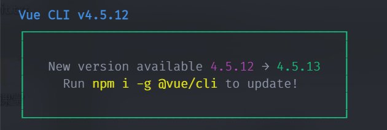
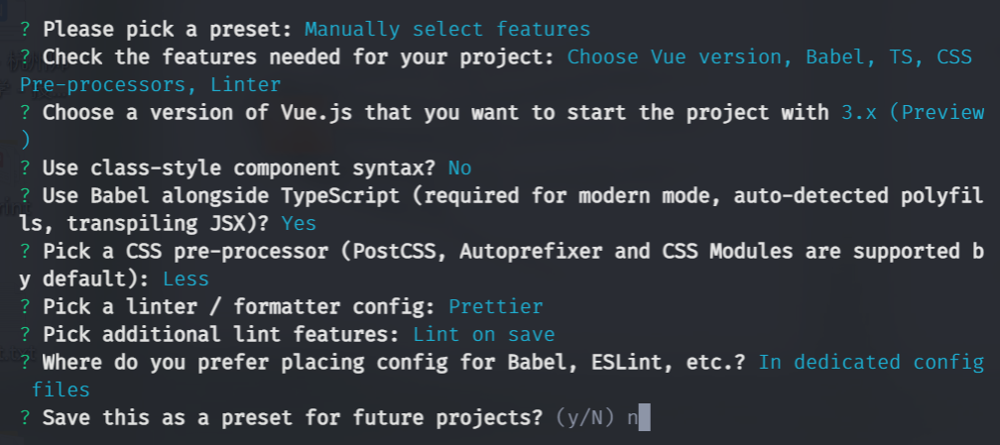
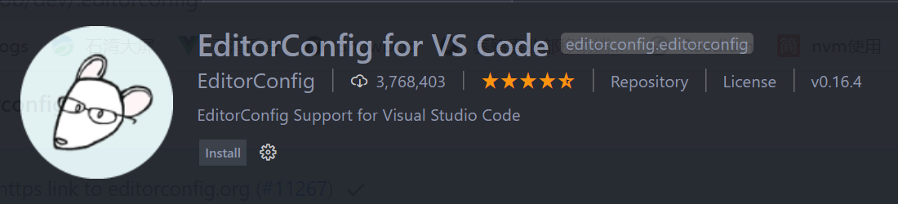
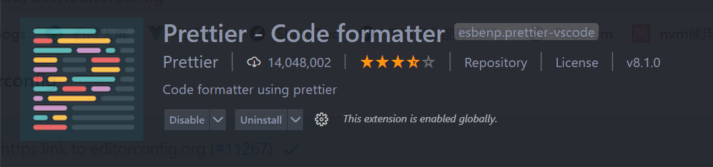
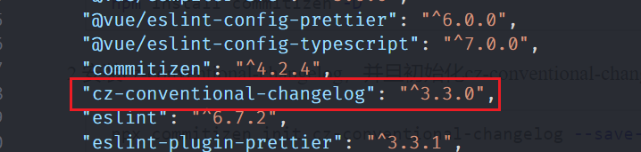
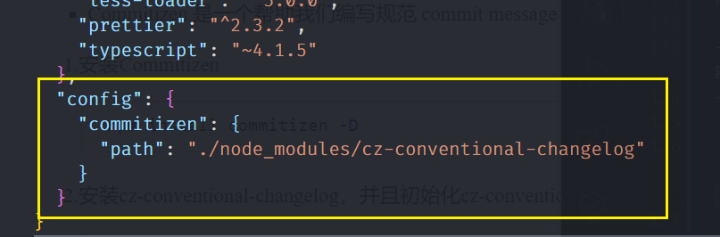
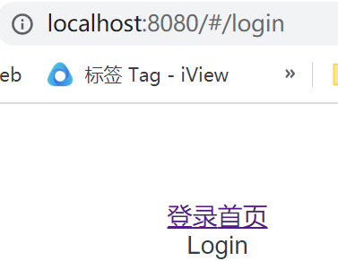
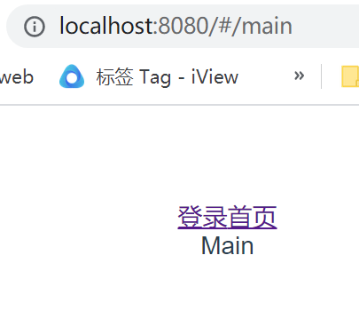

<!--
 * @Author: East Wind
 * @Date: 2021-07-28 20:56:58
 * @LastEditTime: 2021-08-10 22:50:48
 * @LastEditors: Please set LastEditors
 * @Description: In User Settings Edit
 * @FilePath: \Learning-Summary\2021\Vue\项目搭建规范.md
-->

# 项目搭建规范

## 零、项目创建

### 0.1 创建项目

1. `vue create vue3-ts-cms`
2. 配置选择，如图

## 一、代码规范

### 1.1 集成 editorconfig 配置

> Editorconfig 有助于为不同 IDE 编辑器上处理同一项目的多个开发人员维护一致的**代码风格**

参考 Vue

```.editorconfig
# https://editorconfig.org

root = true

[*] # 表示所有文件适用
charset = utf-8 # 设置文件的字符集
indent_style = space # 缩进风格
indent_size = 2 # 缩进大小
end_of_line = lf # 控制换行的类型( lf | cr | crlf )
insert_final_newline = true # 始终在文件末尾插入一个空行
trim_trailing_whitespace = true # 去除行首的任意空白字符

[*.md] # 表示仅 md 文件适用以下规则
insert_final_newline = false
trim_trailing_whitespace = false
```

VSCode 需要安装一个插件：`EditorConfig for VSCode`


### 1.2 使用 prettier 工具

> Prettier 是一款强大的代码格式化工具。

1. 安装 prettier：`npm install prettier -D`
2. 配置 `.prettierrc` 文件
   ```json
   {
     "useTabs": false, # 使用 tab 缩进还是空格缩进，选择false
     "tabWidth": 2, # 当 tab 是空格的情况下，是几个空格
     "printWidth": 80, # 当行字符的长度
     "singleQuote": true, # 使用单引号还是双引号，true为单引号
     "trailingComma": "none", # 在多行输入的尾逗号是否添加，设置为none不添加
     "semi": false # 语句末尾是否加分号，默认true，false不加
   }
   ```
3. 创建 `.prettierignore` 文件

   ```.prettierignore
   /dist/*
   .local
   .output.js
   /node_modules/**

   **/*.svg
   **/*.sh

   /public/*
   ```

4. 安装 prettier 插件
5. 在 package.json 文件的 script 部分中添加脚本：`"prettier": "prettier --write ."`
6. `npm run prettier` 即可

### 1.3 解决 eslint 和 prettier 冲突

1. 在前面创建项目的时候，选择了 ESLint ，所以 Vue 会默认配置需要的 ESLint 环境
2. VS Code 需要安装 ESLint 插件
3. `npm install eslint-plugin-prettier eslint-config-prettier -D`(实际上不需要安装，在一开始的设置中 eslint + prettier 时就会设置安装)
4. 在 .eslintrc.js 文件中添加配置
   ```javascript
   module.exports = {
     ...,
     extends: [
       ...,
       'plugin:prettier/recommended'
     ]
   }
   ```

### 1.4 git Husky 和 eslint

> 虽然已经要求项目使用 eslint 了，但是不能保证其他人提交代码之前都将 eslint 中的问题解决了

- 即 我们希望保证代码仓库中的代码都是符合 eslint 规范的
- 那么需要在其他人执行`git commit`命令的时候对其进行校验，如果不符合 eslint 规范，那么自动通过规范来进行修复
- Husky：一个 git hook 工具，可以触发 git 提交的各个阶段：pre-commit, commit-msg, pre-push
  - 自动配置命令：`npx husky-init '&&' npm install`(无法)
    - 安装 husky 相关依赖：package.json 中`"husky": "版本号"`
    - 在项目目录下创建 .husky 文件夹
  - (实际上)：
    - `npm install husky`
    - `npx husky install`，root 目录下出现 .husky 文件夹
    - 在 package.json 文件夹中添加 js 脚本：`"prepare": "husky install"`
    - 在 .husky 文件夹下创建 pre-commit 文件
      ```shell
        #!/bin/sh
        . "$(dirname "$0")/_/husky.sh"
        npm run lint
      ```

### 1.5 git commit 规范

#### 1.5.1 代码提交风格

- 通常我们的 git commit 会按照统一的风格来提交，这样可以快速定位每次提交的内容，方便之后对版本进行控制
- 通常使用 commitizen 工具

  - 安装：`npm install commitizen -D`
  - 安装 cz-conventional-changelog，并且初始化 cz-conventional-changelog：`npx commitizen init cz-conventional-changelog --save-dev --save-exact` 
  - `npx cz`
  - 进入规范流程

| Type     | 作用                                                                                   |
| -------- | -------------------------------------------------------------------------------------- |
| feat     | 新增特性 (feature)                                                                     |
| fix      | 修复 Bug(bug fix)                                                                      |
| docs     | 修改文档 (documentation)                                                               |
| style    | 代码格式修改(white-space, formatting, missing semi colons, etc)                        |
| refactor | 代码重构(refactor)                                                                     |
| perf     | 改善性能(A code change that improves performance)                                      |
| test     | 测试(when adding missing tests)                                                        |
| build    | 变更项目构建或外部依赖（例如 scopes: webpack、gulp、npm 等）                           |
| ci       | 更改持续集成软件的配置文件和 package 中的 scripts 命令，例如 scopes: Travis, Circle 等 |
| chore    | 变更构建流程或辅助工具(比如更改测试环境)                                               |
| revert   | 代码回退                                                                               |

#### 1.5.2 代码提交验证

> 规范代码提交流程，防止 `git commit -m 'msg'` 的出现

1. 安装依赖：`npm i @commitlint/config-conventional @commitlint/cli -D`
2. root 下新建 commitlint.config.js 配置文件
   ```javascript
   module.exports = {
     extends: ["@commitlint/config-conventional"],
   };
   ```
3. .husky 文件夹下新建 commit-msg 文件

   ```shell
   #!/bin/sh
   . "$(dirname "$0")/_/husky.sh"

   npx --no-install commitlint --edit

   ```

## 二、第三方库的集成

### 2.1 vue.config.js 配置

- 配置方式

  - 通过 CLI 提供的配置选项
    ```javascript
    module.exports = {
      outputDir: "./build",
    };
    ```
  - 通过 configureWebpack 修改 webpack 配置

    - 对象形式，直接会被合并
      ```javascript
      module.exports = {
        configureWebpack: {
          resolve: {
            alias: {
              components: "@/components",
            },
          },
        },
      };
      ```
    - 函数形式，接收一个 config，通过 config 来修改配置

      ```javascript
      const path = require("path");

      module.exports = {
        configureWebpack: (config) => {
          config.resolve.alias = {
            "@": path.resolve(__dirname, "src"),
            components: "@/components",
          };
        },
      };
      ```

  - 通过 chainWebpack 修改 webpack 的配置

    ```javascript
    const path = require("path");

    module.exports = {
      chainWebpack: (config) => {
        config.resolve.alias
          .set("@", path.resolve(__dirname, "src"))
          .set("components", path.resolve(__dirname, "@/components"));
      },
    };
    ```

### 2.2 vue-router 集成

- `npm install vue-router@next`
- 新建两个页面，root/src/views 下 login/login.vue 和 main/main.vue
- 在 vue.config.js 添加 views 别名`'views': '@/views'`
- root/src 下新建 router/index.ts

  ```typescript
  import { createRouter, createWebHashHistory } from "vue-router";
  import type { RouteRecordRaw } from "vue-router";

  const routes: RouteRecordRaw[] = [
    {
      path: "/",
      redirect: "/login",
    },
    {
      path: "/login",
      component: () => import("views/login/login.vue"),
    },
    {
      path: "/main",
      component: () => import("views/main/main.vue"),
    },
  ];

  const router = createRouter({
    routes,
    history: createWebHashHistory(),
  });
  export default router;
  ```

- 在 root/src/main.ts 中添加以下代码

  ```typescript
  import router from "./router";

  const app = createApp(App);
  app.use(router);
  ```

- 在 app.vue 中添加代码
  ```html
  <router-link to="/login">登录</router-link>
  <router-link to="/main">首页</router-link>
  <router-view></router-view>
  ```
- `npm run serve`
- 结果图  

### 2.3 vuex 集成

- `npm install vuex@next`
- 在 root/src 下新建 store/index.ts

  ```typescript
  import { createStore } from "vuex";

  const store = createStore({
    state: () => {
      return {
        name: "East Wind",
      };
    },
    mutations: {},
    getters: {},
    actions: {},
  });

  export default store;
  ```

- 在 main.ts 中使用

  ```typescript
  import store from "./store";
  app.use(store);
  ```

- 在 app.vue 中使用 vuex

  ```html
  <h2>{{ $store.state.name }}</h2>
  ```

### 2.4 element-plus 集成

- `npm install element-plus`
- 两种引入方式

  - 全局引入

    ```typescript
    import ElementPlus from "element-plus";
    import "element-plus/lib/theme-chalk/index.css";

    app.use(ElementPlus);
    ```

  - 按需引入

    - `npm install babel-plugin-import -D`
    - root/babel.config.js 中添加如下代码

      ```javascript
      module.exports = {
        plugins: [
          [
            "import",
            {
              libraryName: "element-plus",
              customStyleName: (name) => {
                return `element-plus/lib/theme-chalk/${name}.css`;
              },
            },
          ],
        ],
      };
      ```

      - 封装 -> root/src/global/index.ts 与 该目录下 registerEl.ts

      ```typescript
      /** registerEl.ts */
      import { ElButton } from "element-plus";
      import "element-plus/lib/theme-chalk/base.css";
      import type { App } from "vue";

      const elComponents = [ElButton];

      export default function (app: App): void {
        for (const elComponent of elComponents) {
          app.component(elComponent.name, elComponent);
        }
      }

      /** index.ts */
      import type { App } from "vue";
      import registerEl from "./registerEl";

      export function registerApp(app: App): void {
        registerEl(app);
      }
      ```

      - main.ts 中引入

      ```typescript
      import { registerApp } from "./global/index";
      app.use(registerApp);
      ```

### 2.5 区分不同环境

- 根据不同环境设置不同的环境变量
  - 开发环境 -- development
  - 生产环境 -- production
  - 测试环境 -- test
- 如何区分
  - 手动修改：即每改变一次环境，手动修改相应需要改动的代码（一般是网络请求 URL）
  - 根据 process.env.NODE_ENV 的值进行区分
  - 在 root 下创建 .env 文件
    - .env.development: `VUE_APP_BASE_URL = http://...`
    - .env.production
    - .env.test
    - 使用：`process.VUE_APP_BASE_URL`

### 2.6 axios + ts 集成

#### 2.6.1 axios 介绍

1. 名称由来：ajax i/o system -- coderwhy 理解
2. 功能特点
   1. 在浏览器中发送 XMLHttpRequests 请求
   2. 在 node.js 中发送 http 请求
   3. 支持 Promise API
   4. 拦截请求和响应
   5. 转换请求和响应数据
   6. ...

#### 2.6.2 axios 基本使用

- 安装：`npm install axios`
- root/src/service/axios_demo.ts

  - 导入 axios：`import axios from 'axios'`
  - axios 各种尝试

    - 实例对象

      ```typescript
      axios.request({
        method: "GET",
      });
      ```

    - 配置：全局配置 + 单个配置

      ```typescript
      // 全局配置
      axios.defaults.baseURL = "http://httpbin.org/";
      axios.defaults.timeout = 10000;

      // 单个配置
      axios
        .get("/get", {
          params: {
            name: "east wind",
          },
          timeout: 3000,
          headers: {},
        })
        .then((res) => {
          console.log(res);
        });
      ```

    - axios.all

      ```ts
      axios.defaults.baseURL = "http://httpbin.org/";
      axios
        .all([
          axios.get("/get", { params: { name: "east wind" } }),
          axios.post("/post", { data: { name: "east wind", age: 22 } }),
        ])
        .then((res) => {
          console.log(res[0]);
          console.log(res[1]);
        });
      ```

    - axios 的拦截器

      ```ts
      axios.interceptors.request.use(
        (config) => {
          console.log("发送请求成功的拦截");
          return config;
        },
        (err) => {
          console.log("发送请求失败的拦截");
          return err;
        }
      );
      axios.interceptors.response.use(
        (res) => {
          console.log("响应返回成功的拦截");
          return res;
        },
        (err) => {
          console.log("响应返回失败的拦截");
          return err;
        }
      );
      ```

- 确保 axios_demo.ts 执行，将其在 main.ts 中引入：`import './service/axios_demo.ts'`
- 补充知识
  - Promise 本身是可以有类型的
    ```typescript
    new Promise<string>((resolve, reject) => {
      resolve('123')
    }).then((res) => {
      res 是字符串类型
    })
    // 如果 resolve() 中传入除 string 外的类型，会报错
    ```

#### 2.6.3 使用 ts 封装 axios

1. 大体框架
   1. 在 src/service/request/index.ts 中封装网络请求类 EASTRequest
   2. 在 src/service/index.ts 中根据网络请求类创建实例 eastRequest
   3. 在 main.ts 中使用该实例发送网络请求 eastRequest.request()
2. 一个简单的网络请求实现

   1. src/service/request/index.ts 中

      ```ts
      import axios from "axios";
      import type { AxiosInstance, AxiosRequestConfig } from "axios";

      class EASTRequest {
        instance: AxiosInstance; // 类实例

        /** 构造函数 */
        constructor(config: AxiosRequestConfig) {
          this.instance = axios.create(config); // 构建 axios 的 instance
        }

        request(config: AxiosRequestConfig): void {
          this.instance.request(config).then((res) => {
            console.log(res);
          });
        }
      }

      export default EASTRequest;
      ```

   2. src/service/index.ts 中

      ```ts
      import EASTRequest from "./request";
      import { BASE_URL, TIME_OUT } from "./request/config";

      const eastRequest = new EASTRequest({
        baseURL: BASE_URL,
        timeout: TIME_OUT,
      });

      export default eastRequest;
      ```

   3. main.ts 中

      ```ts
      import eastRequest from "./service";
      eastRequest.request({
        url: "/home/multidata",
        method: "GET",
      });
      ```

3. 封装拦截器

   1. src/service/request/type.ts -- 类型

      ```ts
      import type { AxiosRequestConfig, AxiosResponse } from "axios";

      // 拦截器
      export interface EASTRequestInterceptors {
        requestInterceptor?: (config: AxiosRequestConfig) => AxiosRequestConfig;
        requestInterceptorCatch?: (err: any) => any;
        responseInterceptor?: (res: AxiosResponse) => AxiosResponse;
        responseInterceptorCatch?: (err: any) => any;
      }

      // config
      export interface EASTRequestConfig extends AxiosRequestConfig {
        interceptors?: EASTRequestInterceptors;
      }
      ```

   2. src/service/request/index.ts 中

      ```ts
      import axios from "axios";
      import type { AxiosInstance } from "axios";
      import type { EASTRequestConfig, EASTRequestInterceptors } from "./type";

      class EASTRequest {
        instance: AxiosInstance; // 类实例
        interceptors?: EASTRequestInterceptors;

        /** 构造函数 */
        constructor(config: EASTRequestConfig) {
          this.instance = axios.create(config); // 构建 axios 的 instance
          this.interceptors = config.interceptors;

          // 请求拦截
          this.instance.interceptors.request.use(
            this.interceptors?.requestInterceptor,
            this.interceptors?.requestInterceptorCatch
          );

          // 响应拦截
          this.instance.interceptors.response.use(
            this.interceptors?.responseInterceptor,
            this.interceptors?.responseInterceptorCatch
          );

          /** 添加所有实例都有的拦截器 */
          // 请求拦截
          this.instance.interceptors.request.use(
            (config) => {
              console.log("所有实例共同的--------请求成功的拦截");
              return config;
            },
            (err) => {
              console.log("所有实例共同的--------请求失败的拦截");
              return err;
            }
          );
          // 响应拦截
          this.instance.interceptors.response.use(
            (res) => {
              console.log("所有实例共同的--------响应成功的拦截");
              return res;
            },
            (err) => {
              console.log("所有实例共同的--------响应失败的拦截");
              return err;
            }
          );
        }

        request(config: EASTRequestConfig): void {
          // 单个网络请求的拦截
          if (config.interceptors?.requestInterceptor) {
            config = config.interceptors.requestInterceptor(config);
          }

          this.instance.request(config).then((res) => {
            // 单个网络响应的拦截
            if (config.interceptors?.responseInterceptor) {
              res = config.interceptors.responseInterceptor(res);
            }
            console.log(res);
          });
        }
      }

      export default EASTRequest;
      ```

   3. src/service/index.ts 中

      ```ts
      import EASTRequest from "./request";
      import { BASE_URL, TIME_OUT } from "./request/config";

      const eastRequest = new EASTRequest({
        baseURL: BASE_URL,
        timeout: TIME_OUT,
        interceptors: {
          // 每个实例可以拥有自己的拦截器
          requestInterceptor: (config) => {
            console.log("每个实例自己的--------请求成功的拦截");
            return config;
          },
          requestInterceptorCatch: (err) => {
            console.log("每个实例自己的--------请求失败的拦截");
            return err;
          },
          responseInterceptor: (res) => {
            console.log("每个实例自己的--------响应成功的拦截");
            return res;
          },
          responseInterceptorCatch: (err) => {
            console.log("每个实例自己的--------响应失败的拦截");
            return err;
          },
        },
      });

      export default eastRequest;
      ```

4. 具体需求

   1. 携带 token -- src/service/index.ts 中

      ```ts
      const eastRequest = new EASTRequest({
        baseURL: BASE_URL,
        timeout: TIME_OUT,
        interceptors: {
          // 每个实例可以拥有自己的拦截器
          requestInterceptor: (config) => {
            console.log("携带token");
            const token = `East Wind's token`;
            if (token) {
              config.headers.Authorization = `Bear ${token}`;
            }
            return config;
          },
        },
      });
      ```

   2. loading

      ```ts
      /** src/service/request/index.ts */
      import axios from 'axios'
      import type { AxiosInstance } from 'axios'
      import type { EASTRequestConfig, EASTRequestInterceptors } from './type'

      // Loading 引入
      import { ElLoading } from 'element-plus'
      import { ILoadingInstance } from 'element-plus/lib/el-loading/src/loading.type'

      const DEFAULT_LOADING = false

      class EASTRequest {
        instance: AxiosInstance // 类实例
        interceptors?: EASTRequestInterceptors
        loading?: ILoadingInstance
        showLoading: boolean

        /** 构造函数 */
        constructor(config: EASTRequestConfig) {
          this.instance = axios.create(config) // 构建 axios 的 instance

          // 保存基本信息
          this.interceptors = config.interceptors
          this.showLoading = config.showLoading ?? DEFAULT_LOADING

          // 从 config 中取出的拦截器是对应的实例的拦截器
          this.instance.interceptors.request.use(
            this.interceptors?.requestInterceptor,
            this.interceptors?.requestInterceptorCatch
          )

          // 响应拦截
          this.instance.interceptors.response.use(
            this.interceptors?.responseInterceptor,
            this.interceptors?.responseInterceptorCatch
          )

          /** 添加所有实例都有的拦截器 */
          // 请求拦截
          this.instance.interceptors.request.use(
            (config) => {
              console.log('所有实例共同的--------请求成功的拦截')
              if (this.showLoading) {
                // 使用 Loading
                this.loading = ElLoading.service({
                  lock: true, // 遮罩层
                  text: '正在请求数据中...', // 图标下的文字
                  background: 'rgba(0, 0, 0, 0.5)'
                })
              }
              return config
            },
            (err) => {
              console.log('所有实例共同的--------请求失败的拦截')
              return err
            }
          )
          // 响应拦截
          this.instance.interceptors.response.use(
            (res) => {
              console.log('所有实例共同的--------响应成功的拦截')
              setTimeout(() => {
                // 移除 loading
                this.loading?.close()
              }, 1000)
              return res.data
            },
            (err) => {
              console.log('所有实例共同的--------响应失败的拦截')
              // 移除 loading
              this.loading?.close()
              return err
            }
          )
        }

        request(config: EASTRequestConfig) {
          // 单个网络请求的拦截
          if (config.interceptors?.requestInterceptor) {
            config = config.interceptors.requestInterceptor(config)
          }

          if (config.showLoading) {
            this.showLoading = config.showLoading
          }

          this.instance
            .request(config)
            .then((res) => {
              // 单个网络响应的拦截
              if (config.interceptors?.responseInterceptor) {
                res = config.interceptors.responseInterceptor(res)
              }
              console.log(res)
              this.showLoading = DEFAULT_LOADING
            })
            .catch((err) => {
              this.showLoading = DEFAULT_LOADING
            })
        }

      export default EASTRequest

      /** src/service/index.ts */
      import EASTRequest from './request'
      import { BASE_URL, TIME_OUT } from './request/config'

      const eastRequest = new EASTRequest({
        baseURL: BASE_URL,
        timeout: TIME_OUT,
        interceptors: {
          // 每个实例可以拥有自己的拦截器
          requestInterceptor: (config) => {
            console.log('携带token')
            const token = `East Wind's token`
            if (token) {
              config.headers.Authorization = `Bear ${token}`
            }
            return config
          },
          requestInterceptorCatch: (err) => {
            console.log('每个实例自己的--------请求失败的拦截')
            return err
          },
          responseInterceptor: (res) => {
            console.log('每个实例自己的--------响应成功的拦截')
            return res
          },
          responseInterceptorCatch: (err) => {
            console.log('每个实例自己的--------响应失败的拦截')
            return err
          }
        }
      })

      export default eastRequest

      /** main.ts */
      eastRequest
        .request({
          url: '/home/multidata',
          method: 'GET',
          interceptors: {
            requestInterceptor: (config) => {
              console.log('单独请求的config')
              return config
            },
            responseInterceptor: (res) => {
              console.log('单独响应的res')
              return res
            }
          },
          showLoading: true
        })
      ```

5. 真正实现返回值

   1. src/service/request/type.ts

      ```ts
      import type { AxiosRequestConfig, AxiosResponse } from "axios";

      // 拦截器
      export interface EASTRequestInterceptors<T = AxiosResponse> {
        requestInterceptor?: (config: AxiosRequestConfig) => AxiosRequestConfig;
        requestInterceptorCatch?: (err: any) => any;
        responseInterceptor?: (res: T) => T;
        responseInterceptorCatch?: (err: any) => any;
      }

      // config
      export interface EASTRequestConfig<T = AxiosResponse>
        extends AxiosRequestConfig {
        interceptors?: EASTRequestInterceptors<T>;
        showLoading?: boolean;
      }
      ```

   2. src/service/request/index.ts 中

      ```ts
      import axios from "axios";
      import type { AxiosInstance } from "axios";
      import type { EASTRequestConfig, EASTRequestInterceptors } from "./type";

      // Loading 引入
      import { ElLoading } from "element-plus";
      import { ILoadingInstance } from "element-plus/lib/el-loading/src/loading.type";

      const DEFAULT_LOADING = false;

      class EASTRequest {
        instance: AxiosInstance; // 类实例
        interceptors?: EASTRequestInterceptors;
        loading?: ILoadingInstance;
        showLoading: boolean;

        /** 构造函数 */
        constructor(config: EASTRequestConfig) {
          this.instance = axios.create(config); // 构建 axios 的 instance

          // 保存基本信息
          this.interceptors = config.interceptors;
          this.showLoading = config.showLoading ?? DEFAULT_LOADING;

          // 从 config 中取出的拦截器是对应的实例的拦截器
          this.instance.interceptors.request.use(
            this.interceptors?.requestInterceptor,
            this.interceptors?.requestInterceptorCatch
          );

          // 响应拦截
          this.instance.interceptors.response.use(
            this.interceptors?.responseInterceptor,
            this.interceptors?.responseInterceptorCatch
          );

          /** 添加所有实例都有的拦截器 */
          // 请求拦截
          this.instance.interceptors.request.use(
            (config) => {
              console.log("所有实例共同的--------请求成功的拦截");
              if (this.showLoading) {
                // 使用 Loading
                this.loading = ElLoading.service({
                  lock: true, // 遮罩层
                  text: "正在请求数据中...", // 图标下的文字
                  background: "rgba(0, 0, 0, 0.5)",
                });
              }
              return config;
            },
            (err) => {
              console.log("所有实例共同的--------请求失败的拦截");
              return err;
            }
          );
          // 响应拦截
          this.instance.interceptors.response.use(
            (res) => {
              console.log("所有实例共同的--------响应成功的拦截");
              setTimeout(() => {
                // 移除 loading
                this.loading?.close();
              }, 1000);
              return res.data;
            },
            (err) => {
              console.log("所有实例共同的--------响应失败的拦截");
              // 移除 loading
              this.loading?.close();
              return err;
            }
          );
        }

        request<T>(config: EASTRequestConfig<T>): Promise<T> {
          return new Promise((resolve, reject) => {
            // 单个网络请求的拦截
            if (config.interceptors?.requestInterceptor) {
              config = config.interceptors.requestInterceptor(config);
            }

            if (config.showLoading) {
              this.showLoading = config.showLoading;
            }

            this.instance
              .request<any, T>(config)
              .then((res) => {
                // 单个网络响应的拦截
                if (config.interceptors?.responseInterceptor) {
                  res = config.interceptors.responseInterceptor(res);
                }
                console.log(res);
                this.showLoading = DEFAULT_LOADING;
                resolve(res);
              })
              .catch((err) => {
                this.showLoading = DEFAULT_LOADING;
                reject(err);
              });
          });
        }

        get<T>(config: EASTRequestConfig<T>): Promise<T> {
          return this.request<T>({ ...config, method: "GET" });
        }

        post<T>(config: EASTRequestConfig<T>): Promise<T> {
          return this.request<T>({ ...config, method: "POST" });
        }

        delete<T>(config: EASTRequestConfig<T>): Promise<T> {
          return this.request<T>({ ...config, method: "DELETE" });
        }

        patch<T>(config: EASTRequestConfig<T>): Promise<T> {
          return this.request<T>({ ...config, method: "PATCH" });
        }
      }

      export default EASTRequest;
      ```

   3. src/service/index.ts 中

      ```ts
      import EASTRequest from "./request";
      import { BASE_URL, TIME_OUT } from "./request/config";

      const eastRequest = new EASTRequest({
        baseURL: BASE_URL,
        timeout: TIME_OUT,
        interceptors: {
          // 每个实例可以拥有自己的拦截器
          requestInterceptor: (config) => {
            console.log("携带token");
            const token = `East Wind's token`;
            if (token) {
              config.headers.Authorization = `Bear ${token}`;
            }
            return config;
          },
          requestInterceptorCatch: (err) => {
            console.log("每个实例自己的--------请求失败的拦截");
            return err;
          },
          responseInterceptor: (res) => {
            console.log("每个实例自己的--------响应成功的拦截");
            return res;
          },
          responseInterceptorCatch: (err) => {
            console.log("每个实例自己的--------响应失败的拦截");
            return err;
          },
        },
      });

      export default eastRequest;
      ```

   4. main.ts 中

      ```ts
      import eastRequest from "./service";

      interface DataType {
        data: any;
        returnCode: string;
        success: boolean;
      }

      eastRequest
        .request<DataType>({
          url: "/home/multidata",
          method: "GET",
          interceptors: {
            requestInterceptor: (config) => {
              console.log("单独请求的config");
              return config;
            },
            responseInterceptor: (res) => {
              console.log("单独响应的res");
              return res;
            },
          },
          showLoading: true,
        })
        .then((res) => {
          console.log(res);
          console.log(res.data);
          console.log(res.returnCode);
          console.log(res.success);
        });
      ```

## 正经逻辑

## 权限管理

`npm install coderwhy -g`

`coderwhy add3page user -d src/views/main/system/user`
`coderwhy add3page role -d src/views/main/system/role`
`coderwhy add3page department -d src/views/main/system/department`
`coderwhy add3page menu -d src/views/main/system/menu`

`coderwhy add3page category -d src/views/main/product/category`
`coderwhy add3page goods -d src/views/main/product/goods`

`coderwhy add3page list -d src/views/main/story/list`
`coderwhy add3page chat -d src/views/main/story/chat`

`coderwhy add3page overview -d src/views/main/analysis/overview`
`coderwhy add3page dashboard -d src/views/main/analysis/dashboard`

## 补充知识点

1. npx 命令运行 node_modules 文件夹下 .bin 下的命令
