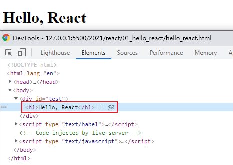

# React 全家桶
## 课程 by 张天禹

<br>

## react 简介
课程包括：
+ React 基础
+ React-Router
+ PubSub
+ Redux
+ Ant-Design

1. React 是什么？
   1. 官网：用于构建用户界面的 JavaScript 库
   2. 张天禹：是一个将数据渲染为 HTML 视图的开源 JavaScript 库
2. 谁开发的？
   1. FaceBook，开源
3. 为什么要学？
   1. 原生 JavaScript 操作 DOM 繁琐、效率低（DOM-API 操作 UI）
   2. 使用 JavaScript 直接操作 DOM，浏览器会进行大量的<strong>重绘重排</strong>
   3. 原生 JavaScript 没有<strong>组件化</strong>编码方案，代码复用率低
4. React 的特点
   1. 采用<strong>组件化</strong>模式、<strong>声明式编码</strong>，提高代码效率及组件复用率
   2. 在 React Native 中可以使用 React 语法进行移动端开发
   3. 使用<strong>虚拟DOM</strong>+优秀的 <strong>Diffing 算法</strong>，尽量减少与真实 DOM 的交互 ——高效的原因
5. 学习 React 之前需要掌握的 JavaScript 基础知识
   1. 判断 this 的指向
   2. class(类)
   3. ES6 语法规范
   4. npm 包管理器
   5. 原型、原型链
   6. 数组常用方法
   7. 模块化

<br>

## 一. React 入门
### 1.1 官网
+ [英文官网](https://reactjs.org/) https://reactjs.org/
+ [中文官网](https://react.docschina.org/) https://react.docschina.org/

### 1.2 React 的基本使用
+ 三个基本文件
  - react.development.js -- react 核心库
  - react-dom.development.js -- react 扩展库，支持 react 操作 dom
  - babel.min.js -- 将 jsx 语法解析成 js 语法
  - 顺序：先 react.development.js ，后 react-dom.development.js
+ hello_react.html
  ```html
  <!DOCTYPE html>
  <html lang="en">
  <head>
    <meta charset="UTF-8">
    <meta http-equiv="X-UA-Compatible" content="IE=edge">
    <!-- 移动端适配 -->
    <meta name="viewport" content="width=device-width, initial-scale=1.0">
    <title>Document</title>
    <script src="https://unpkg.com/react@17/umd/react.development.js" crossorigin></script>
    <script src="https://unpkg.com/react-dom@17/umd/react-dom.development.js" crossorigin></script>
    <script src="https://unpkg.com/babel-standalone@6/babel.min.js"></script>
  </head>
  <body>
    <div id="test"></div>

    <script type="text/babel">
      // 1. 创建虚拟 DOM
      const VDOM = <h1>Hello, React</h1>
      // 2. 渲染虚拟 DOM 到页面，.render(虚拟 DOM, 容器)
      ReactDOM.render(VDOM, document.getElementById('test'))
    </script>
  </body>
  </html>
  ```
  
+ React 创建虚拟 DOM 方法
  - jsx
  - 纯 JavaScript
